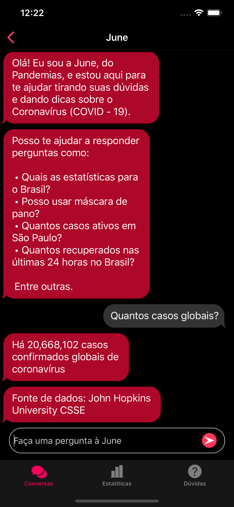
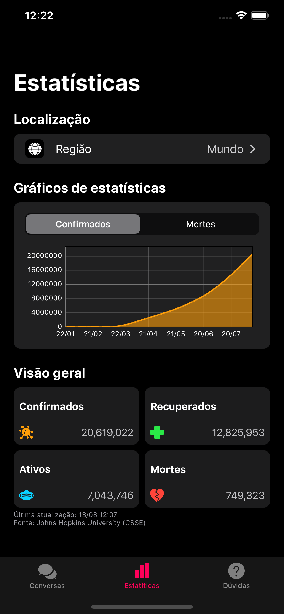
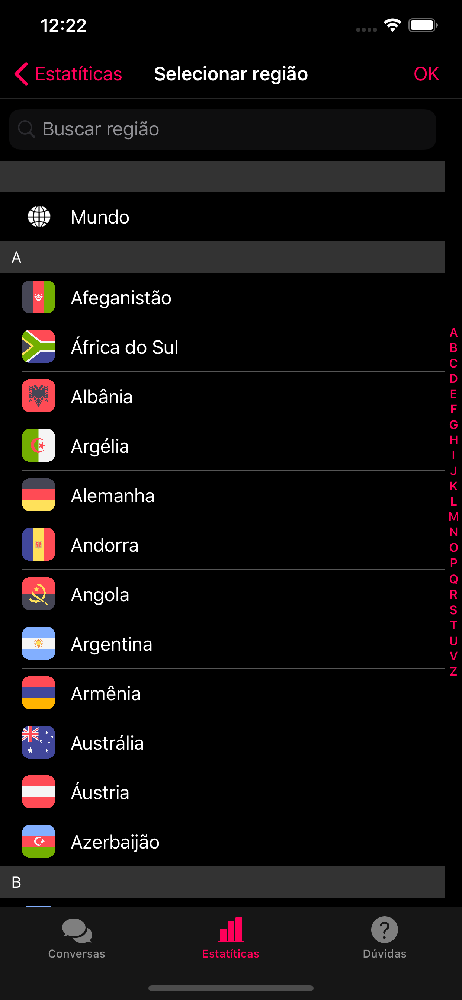
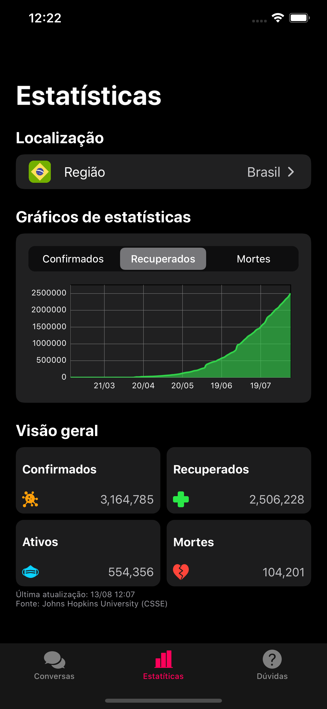
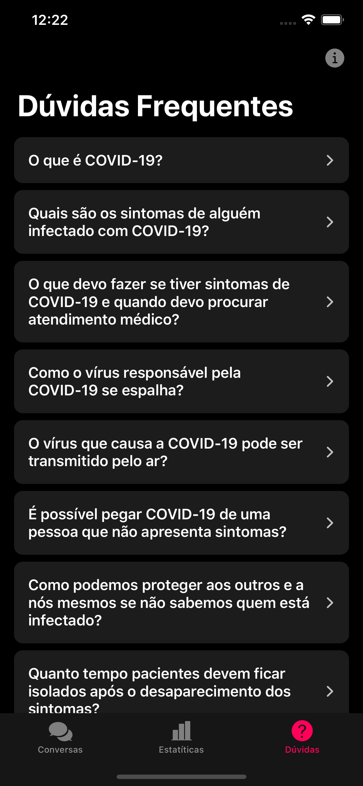

# Pandemias

# Equipe:

[Felipe Luna][00] (Designer)

[Julia Mestre][01] (Desenvolvedora)

[Marina Aranha][02] (Desenvolvedora)

[Matheus Oliveira][03] (Desenvolvedor)

# O que é o Pandemias?

Pandemias é um aplicativo iOS que foi desenvolvido no periodo inicial de quarentena devido ao corona vírus, em março de 2020.

# Qual é o problema ou oportunidade de ação?

Dado o grande volume de informações sobre a pandemia, a quantidade de notícias e informações falsas sobre saúde pública aumentou proporcionalmente. Após pesquisa realizada pela agência Edelman*, notou-se que 64% dos brasileiros preferem redes sociais como fonte de informações à jornais e OMS, estando mais vulneráveis às fake news. A disseminação de orientações falsas pode causar grande impacto na população como o aumento do pânico, ansiedade e até colocar pessoas em risco. 

A oportunidade de ação é reunir informações de fontes confiáveis sobre saúde pública de forma que possa ser acessada de modo fácil e rápido através de um chatbot, gráficos e uma sessão de FAQ.

# Screenshots

[00]:https://www.linkedin.com/in/felipe-luna-a3b25b109/?lipi=urn%3Ali%3Apage%3Ad_flagship3_people_connections%3BZNH3JEdLT7OE51cKmGYqLg%3D%3D&licu=urn%3Ali%3Acontrol%3Ad_flagship3_people_connections-connection_profile
[01]:https://www.linkedin.com/in/julia-conti-mestre/?lipi=urn%3Ali%3Apage%3Ad_flagship3_people_connections%3BZNH3JEdLT7OE51cKmGYqLg%3D%3D&licu=urn%3Ali%3Acontrol%3Ad_flagship3_people_connections-connection_profile
[02]:https://www.linkedin.com/in/marina-miranda-aranha/?lipi=urn%3Ali%3Apage%3Ad_flagship3_people_connections%3BZNH3JEdLT7OE51cKmGYqLg%3D%3D&licu=urn%3Ali%3Acontrol%3Ad_flagship3_people_connections-connection_profile
[03]:https://www.linkedin.com/in/matheus-de-souza-oliveira-642691159/